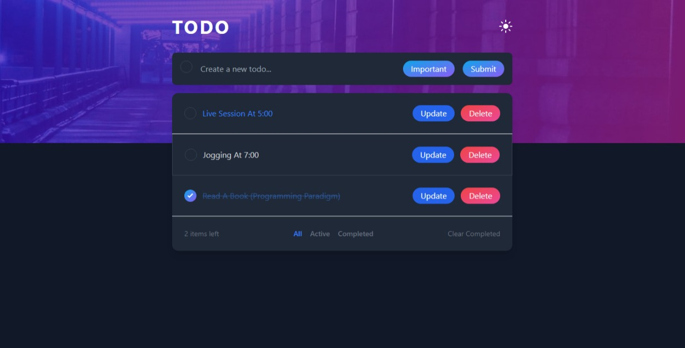

# Software Development Upskill Final Project (BAG)

### Live Demo

Check out the live demo [here](https://todo-app-sigma-henna-15.vercel.app/).



## Todo Application

This project is a simple yet powerful todo application designed to assist users in efficiently tracking and managing their tasks. The application provides a clean and user-friendly interface with essential features such as task addition, removal, prioritization, and clear task filtering.

### Features

- **Add Tasks**: Easily add new tasks to your todo list using a straightforward input form.
  
- **Remove Tasks**: Efficiently remove tasks that are completed or no longer relevant to your agenda.

- **Prioritize Tasks**: Mark tasks as 'Important' to highlight their significance. Visually distinguish important tasks with a distinct style.

- **Update Tasks**: Update" button on a task, and a popup will appear to allow them to modify the task content. The changes will be reflected in the task list after updating..

- **Clear Filtering**: Filter tasks in a clear and organized manner to focus on specific categories or priorities.

### Technology Stack

- **HTML**: Used for structuring the web page with essential elements.

- **CSS**: Provides styling to create a visually appealing and user-friendly interface.

- **JavaScript**: Implements dynamic behavior, allowing users to interact with and manipulate the todo list.

- **Tailwind CSS**: Utilized for efficient and responsive styling, enhancing the overall user experience.

- **React.js 18**: Incorporates the latest features of React.js to create a dynamic and modern user interface.

- **Vite**: Provides features like Hot Module Replacement (HMR) for a faster and more efficient development experience..


### How to Use

1. **Clone the Repository**:
    ```bash
    gh repo clone tuyishimekyrie/todoApp
    ```

2. **Navigate to the Project Directory**:
    ```bash
    cd your-repository
    ```

3. **Open the Application**:
    - For a development environment:
        ```bash
        npm install
        npm start
        ```
    - For a production build:
        ```bash
        npm install
        npm run build
        ```

4. **Access the Application**:
    Open your browser and navigate to [http://localhost:5173](http://localhost:5173).


